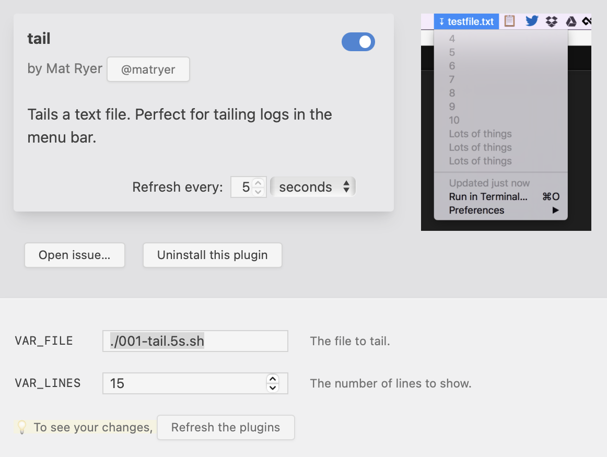

xbar (the BitBar reboot) has shipped, and you might want to upgrade your BitBar plugin.

Your plugin will run in xbar without any changes. However, there are a few tweaks you should make and one or two shiny new features to look at.

# What's new in xbar?

1. Update your metadata - change `<bitbar.*>` tags to `<xbar.*>`
1. Use the `shell` parameter instead of `bash`
1. There is now no limit to the number of `paramN` parameters you can use
1. Use variables (new feature) instead of asking users to edit your scripts
1. Add keyboard shortcuts (new feature) to make your plugins even easier to use

## Variables for configuration

Instead of asking users to edit your plugin script, xbar introduces Variables.



Variables are great for:

* API keys or tokens that your plugin needs
* Different style or presentation options
* Number of items to show

Variables are defined in your plugin's metadata. The xbar UI lets users configure the values without editing your script.

To make it work:

1. Add the `xbar.var` metadata to your plugin code (read the [Metadata documentation](https://github.com/matryer/xbar#metadata))
1. Remove any previous variables
1. Get the values by using environment variables

## Keyboard shortcuts

xbar lets you specify keyboard shortcuts for your menu items.

Use the `key` parameter:

```
Let's go | key=shift+g | href=https://xbarapp.com/
```

You can specify a range of modifiers and special keys, for a full list check out the [Parameters documentation](https://github.com/matryer/xbar#parameters).

# Please try xbar, and report any issues

xbar is still brand new, so please help us reach a full release by reporting any issues you find.
